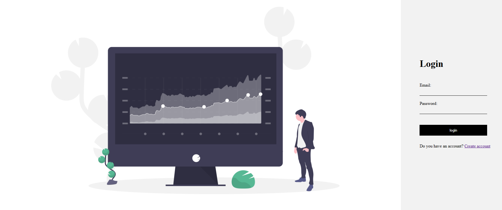
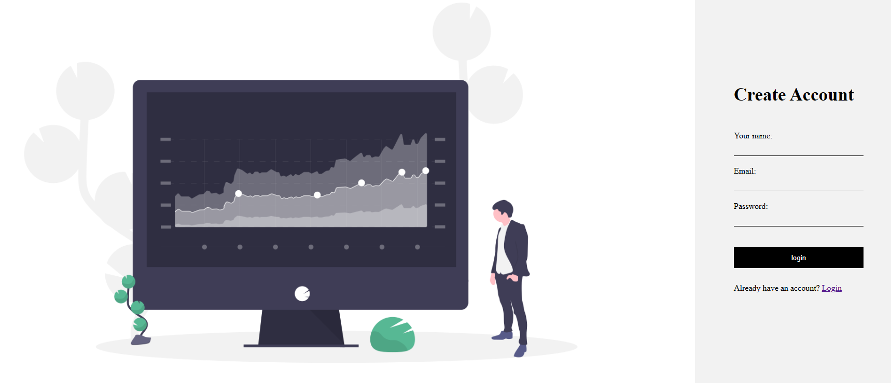
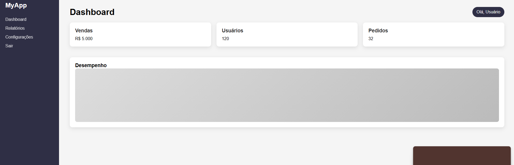

<h3 align="center">🔐Sistema de Login e Cadastro de Usuários </h3>

  

Projeto full stack desenvolvido com foco em autenticação de usuários, utilizando Spring Boot no backend e HTML/CSS no frontend, com persistência de dados em MySQL. 

 
<h4 align="center">
**Tentando usar meu conhecimento após estudos complexos e sem usar IA como muleta, prefiro continuar aprendendo do que não ter merito nenhum porque a IA fez tudo, não quero ser apenas um copia e cola qualquer.**
</h4>

 

📌 Sobre o Projeto

Este projeto implementa um sistema completo de login e cadastro de usuários, permitindo:

Registro de novos usuários
Autenticação (login)
Validação de dados
Persistência em banco de dados

Ideal para estudos de integração entre frontend e backend usando Java.

🚀 Tecnologias Utilizadas
 
🔧 Backend
Java
Spring Boot
Spring Data JPA
Hibernate
 
🎨 Frontend
HTML5
CSS3
 
🗄️ Banco de Dados
MySQL

⚙️ Funcionalidades
✅ Cadastro de usuário
✅ Login com validação
✅ Integração com banco de dados
✅ Organização em camadas (Controller, Service, Repository)

 

🖥️ Funcionalidade Mostrada Em Prática

 - Se não houver uma conta você pode criar uma usando nossa tela de criação de conta. 
 
  

  
  ao clicar em não tenho uma conta vc é redirecionado a tela de criação da conta.
    
  - após a criação da conta ao fazer login 
    
  
  

   você entra no sistema de dashboard que no momento está sem funcionalidades por ser um projeto simples. 
  

🧠 Aprendizados

Durante o desenvolvimento deste projeto, foram aplicados conceitos como:

Arquitetura MVC
Integração entre frontend e backend
Persistência com JPA/Hibernate
Criação de APIs REST
Validação de dados
📸 Preview

 

📌 Melhorias Futuras
🔒 Criptografia de senha (Spring Security / BCrypt)
👤 Sistema de sessões/autenticação avançada
📱 Responsividade no frontend
🌐 Deploy em nuvem
🤝 Contribuição

Sinta-se à vontade para contribuir com melhorias!

Fork o projeto
Crie uma branch (git checkout -b feature/minha-feature)
Commit suas mudanças
Push para a branch
Abra um Pull Request
📄 Licença

Este projeto é apenas para fins educacionais.
